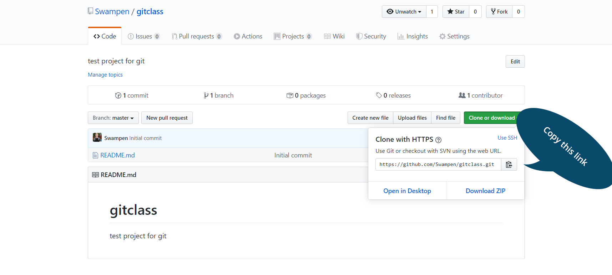

# Workflow 1:  Create and Update My Repo

#### This is your checklist:
- [ ] Create a repo on GitHub (GH)
- [ ] Clone a repo
- [ ] Update a repo 
- [ ] Look at remotes
- [ ] Create a branch
- [ ] Switch to another branch
- [ ] Push changes to GH from terminal
- [ ] Submit a pull request (PR) on GH

---

## Step 0:  Configure user
REMINDER:  did you [configure the user name](./w_0_3_setup.md#step-1--configure-user-on-local-computer)?

## Step 1:  create a repo (on GitHub)
- Click on `+` next to your profile picture
- Select `New Repository`
- Repository name:  `gitclass`
- Description (optional):  `test project for git`
- Repo type
	- `Public` repos:  everyone can view, good for sharing work   
	- `Private` repos: only up to 3 collaborators, you can unlock GitHub Pro for free with your school email [here](https://education.github.com/students).
- Check box for `Initialize this repository with a README` :white_check_mark: :heavy_exclamation_mark:
- Select green button `Create repository`


## Step 2:  Let's add a couple of files
- Add a Markdown file:  `holiday.md`
  - add a line with an emoji
  - I added:  `Looking forward to the party :pizza: ! :smiley:_` :arrow_right: _Looking forward to the party :pizza: ! :smiley:_
  	- Here's the [Emoji Cheat Sheet](https://www.webpagefx.com/tools/emoji-cheat-sheet/) :octocat:  - commit file at end of page
  - commit file at end of page
- Add a Python file:  `hello.py`
  - add a line, the ubiquitous:  `print("Hello World")`
  - commit file at end of page
  - add a description for GitHub commit

### Note: Ensure commit messages are meaningful.


## Step 3: `clone` the repo from GitHub to our terminal

**Q:  What is cloning?**  
**A:  Making a copy of something.**


### Copy URL for cloning

Click on the green button for your forked GitHub repo, and ensure it is showing the url for **Clone with HTTPS**  (other option is "Clone with SSH").  Copy that URL.    <br> 
   <br> <br>




<p>
</p>


>example of my repo's URL  
```text
https://github.com/swampen/gitclass.git
```

## Step 4:  go to working directory (your local terminal)
Go to your working directory  
>example
```bash
cd ~/Desktop/gitsample
```

## Step 5:  clone the repo  
<kbd> git clone <url_name> </kbd> 
>example
```bash
git clone https://github.com/swampen/gitclass.git
```
```bash
Cloning into 'gitclass'...
remote: Counting objects: 3, done.
remote: Total 3 (delta 0), reused 0 (delta 0), pack-reused 0
Unpacking objects: 100% (3/3), done.
```

## Step 6:  `cd` into the repo
<kbd> cd <repo_name> </kbd>
>example
```bash
cd gitclass 
```

## Step 7:  look at remotes
**Q:  What is a remote?**  
**A:  **Remotes** are copies of a repo on another computer **(or on a service like GitHub)****

<kbd> git remote -v </kbd>

>example
```bash
git remote -v
origin	https://github.com/reshamas/gitclass.git (fetch)
origin	https://github.com/reshamas/gitclass.git (push)
```

**Note 1:**  

* notice you have push and pull access  

---

# :arrow_right_hook: Why use branches?
- **Branching** means you diverge from the main line of development and continue to do work without changing the main line, like "scratch paper" but for online coding.  
- Can work on different parts in the codebase, or "features" or "web page updates"
    - create a separate *history* for each new *feature*
- More details can be found here:  [branches](../git_6_branches.md)


## Step 8:  list branches
<kbd> git branch </kbd>  
>example
```git
git branch
* master
```


## Step 9:  create a working branch
<kbd> git branch <branch_name> </kbd>
	

>example  

```git
git branch practice
```

## Step 10:  list branches
<kbd> git branch </kbd>  

>example
```git
git branch
* master
  practice
```

## Step 11:  switch to working branch
<kbd> git checkout <branch_name> </kbd> 

>example

```git
git checkout practice
```


## Step 12:  create a file
<kbd>  ls </kbd>  
<kbd> touch <file_name> </kbd>  
	
<kbd> touch mercury.md </kbd>  

>example

```bash
% touch mercury.md
% ls
total 8
-rw-r--r--  1   32 Nov 22 09:39 README.md
-rw-r--r--  1    0 Nov 22 09:49 mercury.md
```

---
# :arrow_right_hook: Git Workflow

## Git Flow 
| #     | Command                   | Step  | Description      |
|-------|---------------------------| -----|------------------|
|  1    | `git add <filename>` or `git add --all` (to add all files) | begin tracking a file | adds a change in the working directory to the staging area; tells Git that you want to include updates to a particular file in the next commit.  |
|  2    | `git commit -m "message"` | log the change | changes are recorded in Git (interaction is with local repo) |
|  3    | `git push`                | finalize the change | changes are pushed from Git (local, terminal) to GitHub (browser account, remote) |

**Note:**  It is better to make many commits with smaller changes rather than of one commit with massive changes: small commits are easier to read and review.


<p>

</p>

## Step 13:  get status of repo
<kbd> git status </kbd>  
>example
```bash
% git status
On branch practice
Untracked files:
  (use "git add <file>..." to include in what will be committed)
	mercury.md
nothing added to commit but untracked files present (use "git add" to track)
```

## Step 14:  add/stage a file
<kbd> git add <file_name> </kbd>   
	

>example  
```bash
git add mercury.md 
```

**Note:**  to `add` a file is to begin tracking it:  
- adds a change in the working directory to the staging area
- tells Git that you want to include updates to a particular file in the next commit

## Step 15:  get status of repo
<kbd> git status </kbd>  
>example
```bash
% git status
On branch practice
Changes to be committed:
  (use "git reset HEAD <file>..." to unstage)

	new file:   mercury.md
```

## Step 16:  commit a file  
<kbd> git commit -m 'message' </kbd>  
	
>example
```bash
git commit -m 'adding first planet'
```

```bash
% git commit -m 'adding first planet'
[practice 3950dd9] adding first planet
 1 file changed, 0 insertions(+), 0 deletions(-)
 create mode 100644 mercury.md
```
**Note:**  to `commit` a file is to "log the change":  
- changes are recorded in Git (interaction is with local repo)

## Step 17:  get status of repo
<kbd> git status </kbd>  
>example
```bash
% git status
On branch practice
Changes to be committed:
  (use "git reset HEAD <file>..." to unstage)

	new file:   mercury.md
```

## Step 18:  push changes to your 'working branch' 
<kbd> git push --set-upstream <remote_name> \<branch> </kbd>  
	

>example
```bash
git push --set-upstream origin practice
```

```bash
Counting objects: 3, done.
Delta compression using up to 4 threads.
Compressing objects: 100% (2/2), done.
Writing objects: 100% (3/3), 273 bytes | 0 bytes/s, done.
Total 3 (delta 0), reused 0 (delta 0)
To https://github.com/reshamas/gitclass.git
 * [new branch]      practice -> practice
```
**Note:**  to `push` a "commit" is to "finalize the change":  
- changes are pushed from Git (local, terminal) to GitHub (browser account, remote)

## Step 19:  look at files on working branch (on GitHub)
**Note:**  we are on GitHub in browser
- go to repo
- may want to toggle "Branch"
	
## Step 20: merge your changes to the master branch

* now you want to commit your changes from the practice branch, to the master branch

<kbd> git checkout master </kbd>

* make sure you have the newest master branch

<kbd> git pull </kbd>   

* merge the `practice` branch to master

<kbd>git merge practice </kbd>   

> this example demonstrates a good practice in merging 

```git
% git checkout master
Switched to branch 'master'
Your branch is up to date with 'origin/master'.
% git pull
Already up to date.
pit merge practice
```


## Step 20 - alternative:  submit pull request (on GitHub)

Go to GitHub and refresh your browser.  

Select green button "Compare and pull request"  
   <br> <br>

---

## Summary of Steps
<kbd> cd ~/Desktop/gitsample </kbd>   
<kbd>  pwd </kbd>   
<kbd> git clone https://github.com/swampen/gitclass.git </kbd>   
<kbd> cd gitclass </kbd>   
<kbd> git remote -v </kbd>  
<kbd> git pull </kbd>  
<kbd> git branch </kbd> <kbd> git branch practice </kbd>  
<kbd> git branch </kbd> <kbd> git checkout practice </kbd>  
<kbd>  ls </kbd>  
<kbd> touch mercury.md </kbd>  
<kbd>  ls </kbd>  
<kbd>  git status </kbd> <kbd>  git add mercury.md </kbd>  		  
<kbd>  git status </kbd> <kbd>  git commit -m 'adding first planet' </kbd>  		  
<kbd>  git status </kbd> <kbd>  git push origin practice</kbd>  

